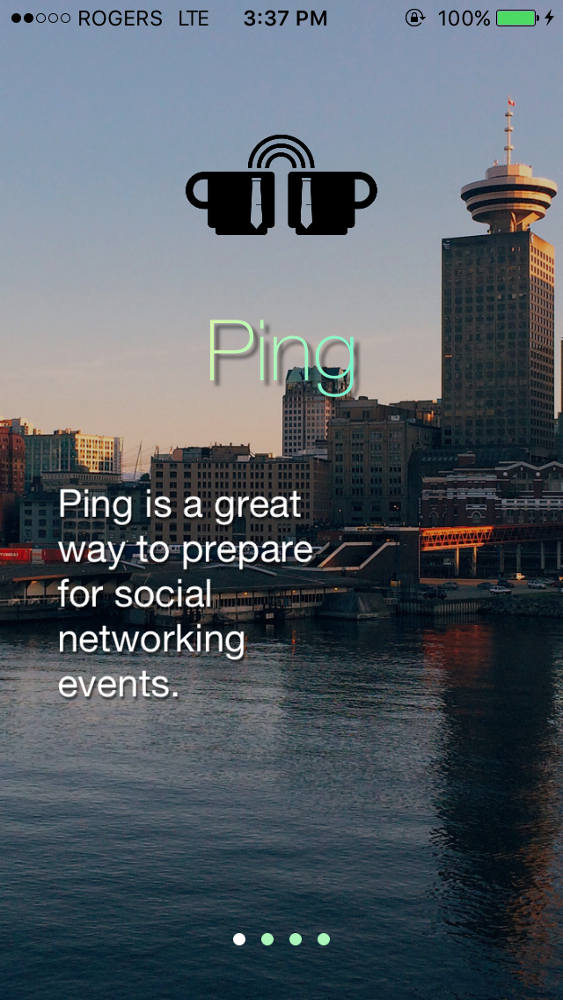
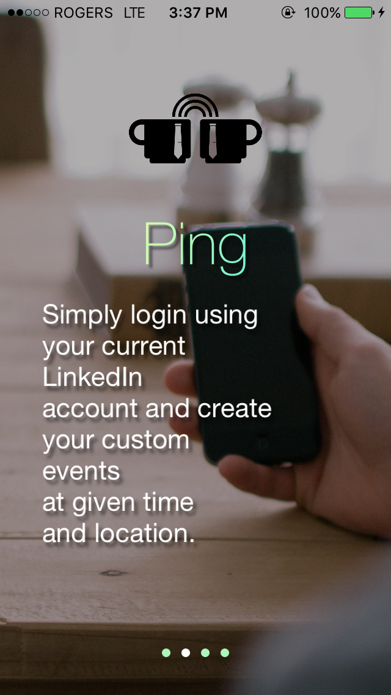
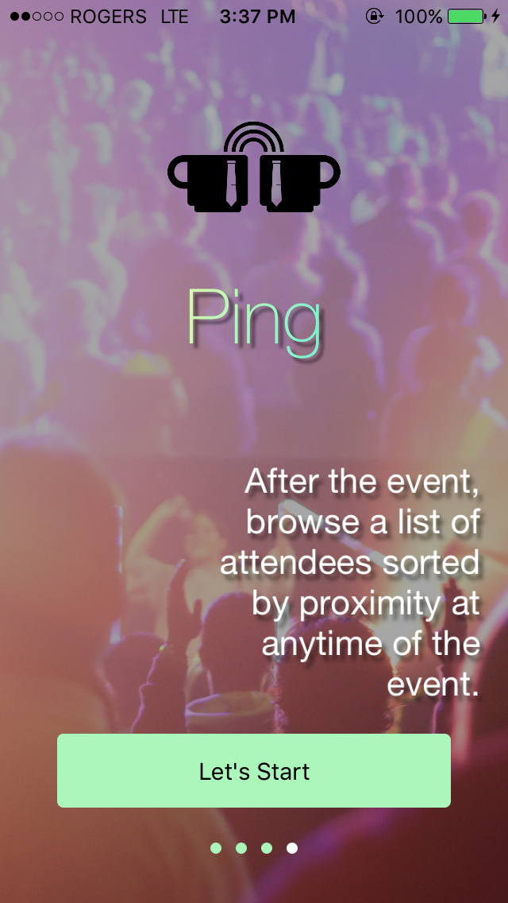
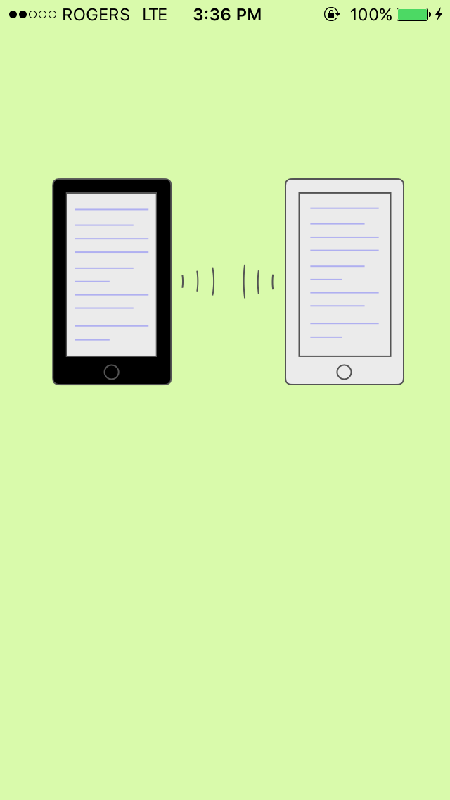
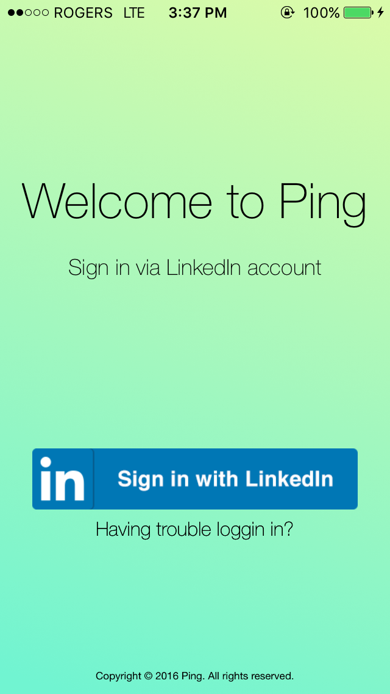
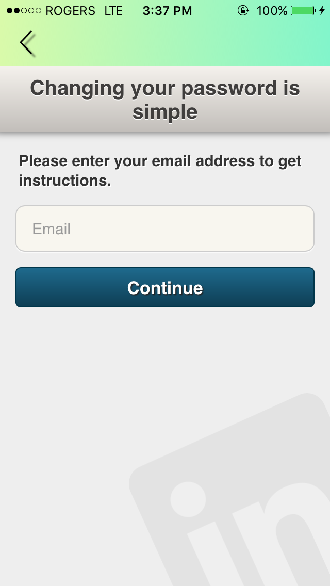
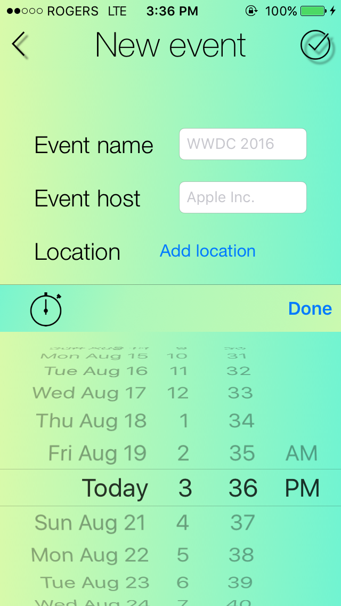
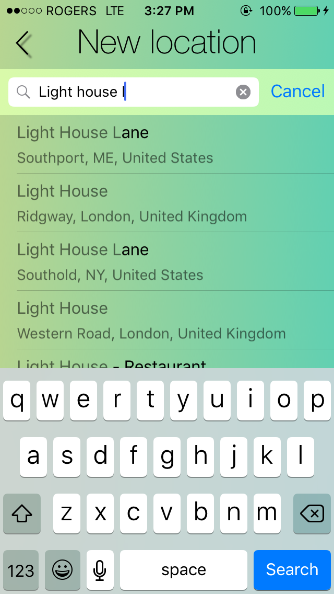
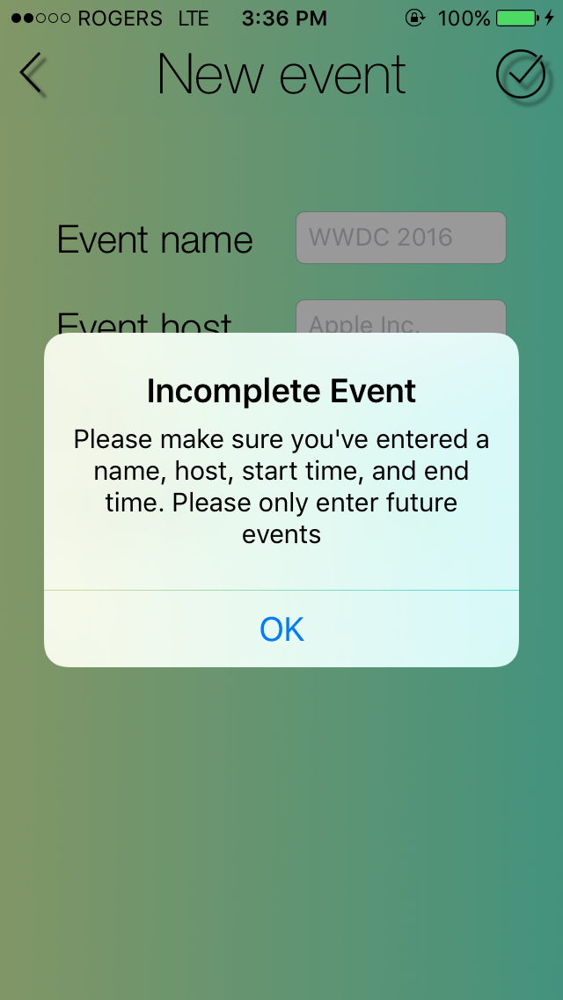

# Ping
 
## Summary 
Ping, a networking application built as a project at Lighthouse Labs. 
Ping measures the distance between users at networking events using Bluetooth running in the background and persists this data-using Realm. Late, users can access a list of other users who attended the event, sorted with those closest to them at a given time at the top of the list. This list includes information profile information gather from LinkedIn’s API, and links to each users LinkedIn profile. Users, profile information is passed between devices using the mobile backend as a service (MBaaS) Parse. Events can be scheduled by the user, which will trigger local notification that launch the app, which starts scanning for bluetooth signals when the even begins. 

## ToDo 
### New Features To be added 
 1. Pre-populate the list of events with 3rd party API's such as meet-up
 2. Add geo-fencing to insure that the user is at the event before turning on the bluetooth 
 3. add a comment field to table view cells so users can make notes about people they have met (comments would be stored locally) 
 
## Tech Used
 1. Core Bluetooth 
 2. Realm 
 3. Parse
 4. Force Touch
 5. Cocoa Pods
 6. SDwebImage
 7. Swift & Objective-C 
 8. LinkedIn SDK
 9. GooglePlaces
 10. Local Notifications 

## Screen Shots

